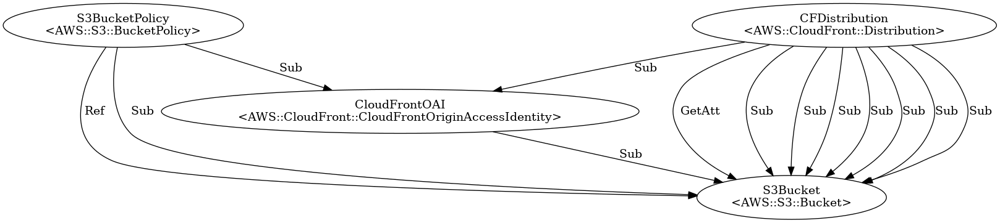

# CloudFormation graph

A script that builds a DOT graph from a CloudFormation template then exports it as a .png image.


## Build

```
sudo apt install graphviz

# (optional) create and activate a virtual env

pip install cfn-lint pydot click
```

## Usage
```
python cloudformation_to_dot_to_image.py <cloudformation-template> <output-dir>
```

## Example
```
python cloudformation_to_dot_to_image.py ../cloudformation/frontend.yaml output
```

### Output
- [output/frontend.yaml.dot](output/frontend.yaml.dot)
- [output/frontend.yaml.png](output/frontend.yaml.png)


